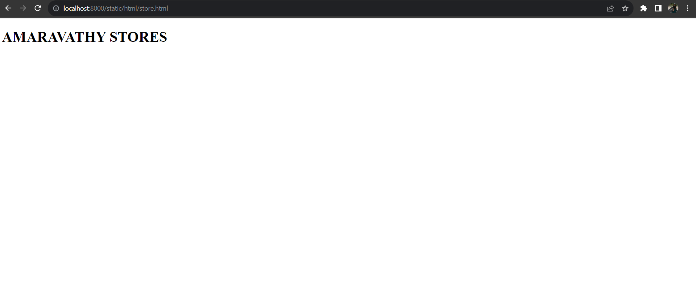

# Places Around Me
## AIM:
To develop a website to display details about the places around my house.

## Date: 21.11.2023

### Step 1:
Create a django admin interface.
### Step 2:
download your city map from google.
### step 3:
using ``` <map>``` tag name the map.
### step 4:
create clickable regions in the image using ``` <area>```tag.
### step 5:
WRite HTML programs for all the regions identified.
### step 6:
Execute the programs and publish them.
## Code:
```
map.html
<!DOCTYPE html>
<html>
    <head>
        <title>image maps devoloper</title>
    </head>
    <body>
        <h1>image maps demo </h1>
        
<map name="image_map">
  <area alt="amaravathystores" title="amaravathystores" href="store.html" coords="735,332,900,448" shape="rect">
  <area alt="new prince school" title="new prince school" href="school.html" coords="108,274,536,657" shape="rect">
  <area alt="saravana print store" title="saravana print store" href="print.html" coords="614,131,755,260" shape="rect">
  <area alt="corporation park" title="corporation park" href="park.html" coords="1089,630,1250,708" shape="rect">
  <area alt="arya tatoos" title="arya tatoos" href="tatoo.html" coords="581,612,790,681" shape="rect">
</map>

    </body>
</html>

park.html
<!DOCTYPE html>
<html>
    <head>
        <title>corporation park</title>
    </head>
    <body>
        <h1>CORPORATION PARK</h1>
    </body>
</html>

print.html

<!DOCTYPE html>
<html>
    <head>
        <title>saravana print shop</title>
    </head>
    <body>
        <h1>SARAVANA PRINT STORE</h1>
    </body>
</html>

school.html

<!DOCTYPE html>
<html>
    <head>
        <title>new prince school</title>
    </head>
    <body>
        <h1>NEW PTRINCE SHRI BHAVANI SENIOR SECONDARY SCHOOL</h1>
    </body>
</html>

store.html

<!DOCTYPE html>
<html>
    <head>
        <title>amaravathy stores</title>
    </head>
    <body>
        <h1>AMARAVATHY STORES</h1>
    </body>
</html>

tatoo.html

<!DOCTYPE html>
<html>
    <head>
        <title>arya tatoos</title>
    </head>
    <body>
        <h1>ARYA TATTOOS</h1>
    </body>
</html>

```

## Output:




## Result:
The image maps has been created successfully.